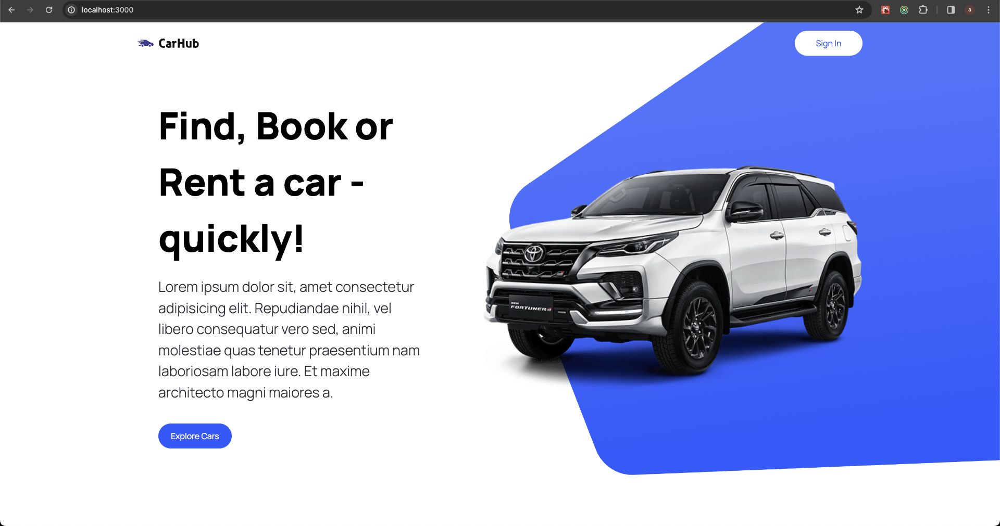

## car search engine

A nextjs (v13.4) based search app.
Primary search is implemented server side.
Allows server side and client side search.
Mostly created as a POC to allow further improvements.

### API's integration

Integrated with `cars-by-api-ninjas` .
All credits go to the website hosting these api's and the api provider.

### Pending/wip work

Auth is not yet implemented.

Same image is used everywhere, those nice car images does not come free :(

Many more...

### Config

Use `.env` to configure

api_key= your key

api_host= host url from above api provider

### How to run

Install deps with your favourite pkg manager.

Configure api keys as above.

Examaple:- with npm

`npm run dev`

and then usual other commands.

### How does it look/work

#### Hoem/landing page

#### Search page

#### Search results page

